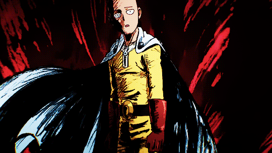

  
  <h1>👋 Hello, I'm Alan Oliveros</h1>
  
Front-End Developer | Passionate About Best Practices & Standards | Mobile-First Advocate

  

---

<h2>💡 Skills & Tools</h2>

  <a href="https://skillicons.dev">
     
    
  </a>
  </a>

---

<h2>⚡ About Me</h2>

- 🎨 Passionate about **pixel-perfect UI** and clean code.
- 📱 Advocate of **mobile-first design** and **performance optimization**.
- 💡 Familiar with advanced effects: scroll-based animation, pixel shaders, glitch effects, and Framer Motion/GSAP/Lenis magic.
- 🧱 Skilled in turning **complex Figma designs** into responsive, accessible, and scalable components.
- 🧪 Experienced in working with **real-time apps**, esports systems, player stats, and admin dashboards.

---

<h2>🌱 Currently Working On</h2>

<ul>
  <li>💻 Developing scalable front-end solutions with <code>React.js</code> and <code>Supabase</code>.</li>
  <li>🎨 Crafting mobile-first, light-themed designs in <strong>Figma</strong>.</li>
  <li>🔧 Optimizing SCSS organization using <code>@use</code> and <code>Sass migrator</code>.</li>
  <li>📦 Speeding up builds and deployment with <code>Vite</code> and <strong>Vercel</strong>.</li>
</ul>

---

<h2>📈 Stats</h2>

  
  

---

<h2>🌐 Connect</h2>

  
  
  

